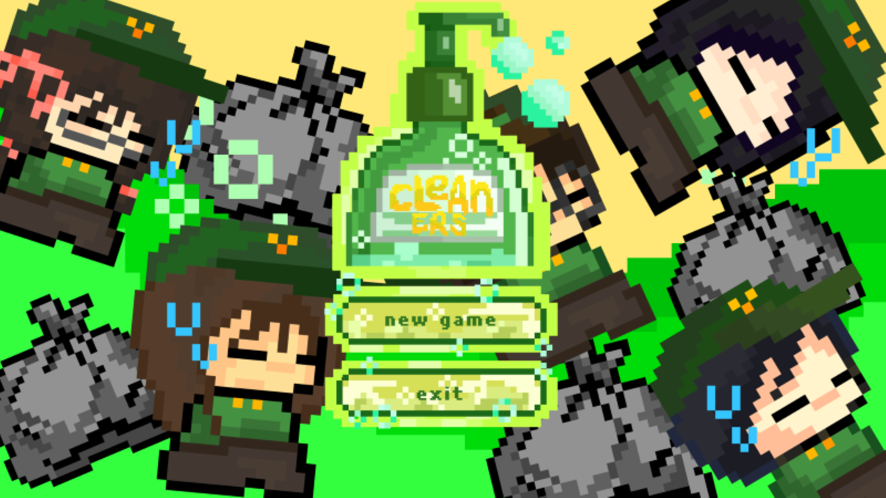

# Classroom Cleanup

Welcome to **Classroom Cleanup**, a simple and fun Python game where you play as a student on a mission to clean up trash around the classroom!  
Built with **Pygame**, this project combines interactive gameplay, power-ups, and a custom classroom map.

## Gameplay

- Move around using **WASD** or **arrow keys**
- Collect different types of trash to earn points
- Grab **Shawarma** or **Lemon** power-ups to increase your speed temporarily
- Watch a short intro video before the game starts
- Enjoy custom graphics and a classroom vibe

## 📸 Preview



## Features

- Custom player sprite and classroom map
- 4 different trash types to collect
- Power-ups with temporary speed boost
- Menu screen & intro video (via MoviePy)
- Sound effects and animations (optional)

## Tech Stack

- [Python 3](https://www.python.org/)
- [Pygame](https://www.pygame.org/news)
- [MoviePy](https://zulko.github.io/moviepy/) (for intro video)

## Getting Started

1. **Clone the repository**

   ```bash
   git clone https://github.com/your-username/classroom-cleanup.git
   cd classroom-cleanup
   ```

2. **Install dependencies**

   ```bash
   pip install pygame moviepy
   ```

3. **Run the game**
   ```bash
   python main.py
   ```
